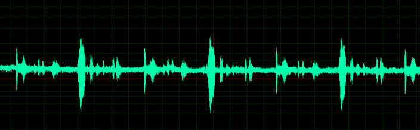

# ProjectSAM
Project for 12th september Explorations
For the purpose of this exsercise I have kept the code very simple as I am in unfamiliar territory. 
<html>
    <head>
        <h1 align="center">SAM</h1> I put in the title and aligned it to the center. 
    
    </head>
    <body>
      
<a href="about.html">About SAM</a>
 Here I linked the the about section which takes us to another page and gives us 
      the discription of what Sam the project is. 
         ((I took an image from an url (https://news.filehippo.com/2014/10/reverse-audio-clip-adobe-audition/))
        I tired to center the image but failed and unable to fix the code so I went back to keeping the audio clip on the left hand side. 
        I also tried to add a heart button using CSS. This was very confusing and seem to make the rest of my page blank. I intend to add the rest of 
        buttons using CSS hopefully by monday. 
    
    </body>

</html>
